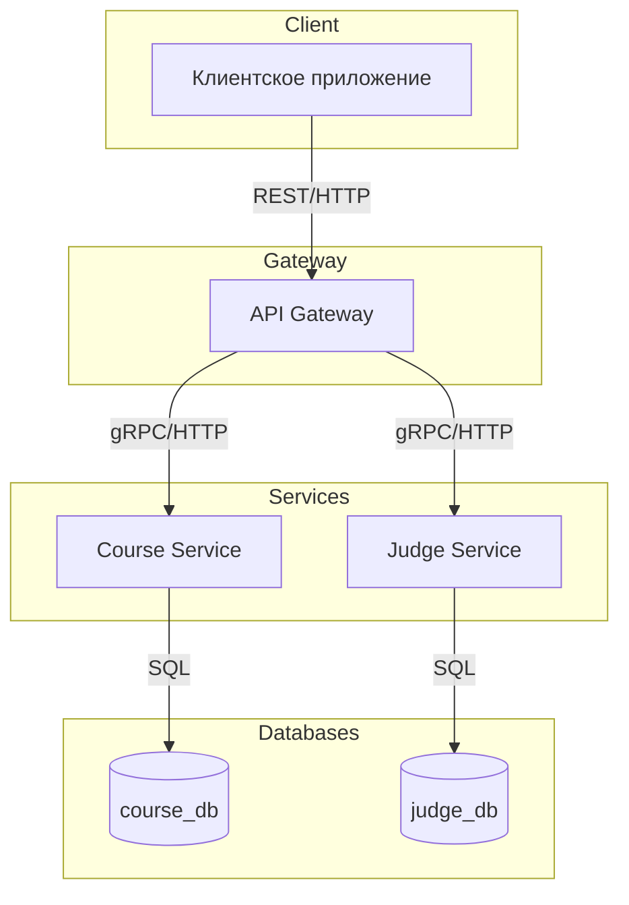
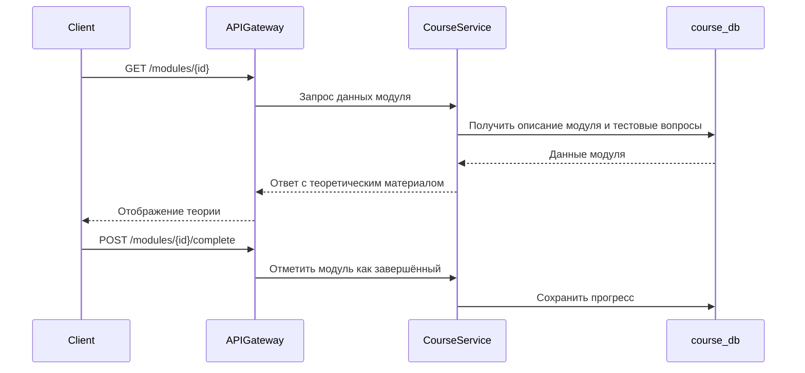
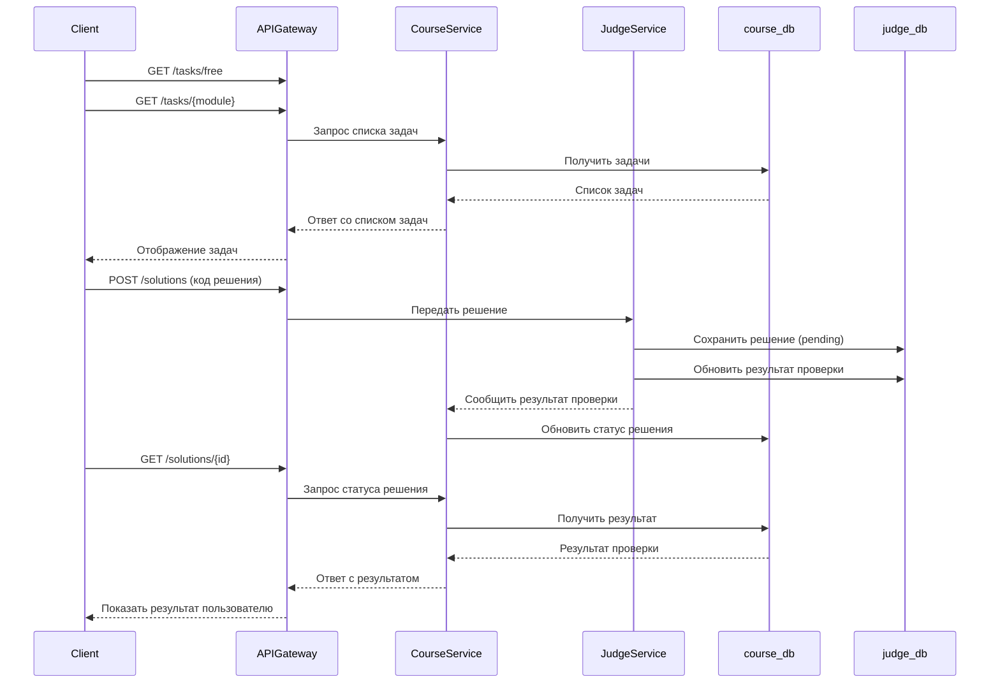

# Техническое решение проекта «LeetBook»

## 1. Введение

«LeetBook» — это учебный проект, реализующий прототип распределённой системы для обучения программированию. Система позволяет изучать аспекты языка программирования и закреплять приобретенные знания посредством решения практических задач. Так же пользователь может тренировать навык решения алгоритмических задач. Платформа автоматически проверяет решения, оценивает их корректность, время выполнения и использование памяти. Проект демонстрирует ключевые принципы построения отказоустойчивых и масштабируемых распределённых приложений.
- **Цель проекта:** реализовать прототип распределённой системы, позволяющей эффективно изучать Python, сочетая теорию и практику. 
- **Задачи:** закрепить теоретические основы распределённых систем (масштабируемость, отказоустойчивость, консистентность) через практическую реализацию.  
- **Основания для разработки:** учебный проект в рамках курса «Основы распределённых вычислений».  
- **Команда:**   Шаймиев Камиль | Team Lead , Backend - разработчик, Frontend - разработчик  
                Маслов Максим | Backend - разработчик, Frontend - разработчик 

---

## 2. Глоссарий
| Термин        | Определение |
|---------------|-------------|
| Задача        | Практическое задание для закрепления теории. |
| Алгоритмическая задача      | Задача без привязки к конкретному топику, нацеленная на развитие алгоритмического мышления. |
| Код решения       | Код, отправленный пользователем для проверки. |
| Тестирование    | Автоматическая проверка корректности, времени и памяти, потребляемых во время исполнения кода решения. |
| API Gateway   | Точка входа для всех клиентских запросов. |
| Реплика       | Копия сервиса, поддерживаемая для отказоустойчивости. |
| Консистентность | Свойство, гарантирующее согласованность состояния данных между репликами. |

---

## 3. Функциональные требования
Система должна предоставлять следующие функции:
1. Изучение теоретических материалов по Python.
2. Выполнение практических задач, прикреплённых к топикам.
3. Решение алгоритмических задач (не привязанных к темам).
4. Автоматическая проверка решений с возвратом результата.  

### Ограничения на предметную область

1. Проверка решений ограничивается поддержкой Python 3.x и C++
2. Пользователь не может изменять условия задач и тесты.

---

## 4. Нефункциональные требования
- **Доступность:** 99.9%.  
- **Масштабируемость:** возможность увеличения числа узлов без модификации логики.  
- **Время отклика:** ≤ 200 мс в условиях локальной сети.  
- **Отказоустойчивость:** система должна продолжать работать при сбое одного из узлов.  
- **Консистентность:** Система использует общую транзакционную БД PostgreSQL как единый источник истины, все операции выполняются в рамках ACID-транзакций. 

---

## 5. Пользовательские сценарии

### Сценарий: изучение теории

1. Пользователь открывает топик «Списки в Python».
2. Пользователь изучает материал.

### Сценарий: решение задачи
1. Пользователь выбирает задачу из общего списка либо привязанную к определенному модулю.  
2. Пользователь пишет решение и отправляет его.  
3. Система проверяет решение.
4. Пользователь видит результат (успех или ошибки).  

### Сценарий: просмотр истории решений
1. Пользователь открывает свой профиль.
2. Система отображает историю отправленных решений с их статусами (успех, ошибка компиляции, превышение лимитов).

## 6. Архитектура

Система состоит из следующих компонентов:

| Компонент | Назначение |
|------------|-------------|
| **API Gateway** | Центральная точка входа для всех клиентских запросов. Выполняет маршрутизацию, валидацию данных. |
| **Course Service** | Отвечает за хранение и выдачу учебных курсов, теоретических материалов и задач. |
| **Judge Service** | Принимает решения пользователей на проверку, выполняет их в изолированной среде, анализирует результаты (успех, ошибка, превышение лимита) и возвращает отчёт. |
| **course_db** | БД, которая хранит непосредственно теоретическую часть всех модулей, задачи и тесты к ним |
<!-- | **judge_db** | БД, которая хранит информацию по отправленным решениям. | -->

## 7. Технические сценарии

### Сценарий: изучение теории

1. Пользователь в клиентском приложении выбирает теоретический модуль (например, «Списки в Python»).  
2. Клиентское приложение отправляет запрос на получение данных о модуле в `API Gateway`.  
3. `API Gateway` перенаправляет запрос в `Course Service`.  
4. `Course Service` возвращает описание теоретического материала.  
5. Пользователь изучает материал.  

### Сценарий: решение задачи

1. Пользователь в клиентском приложении выбирает раздел «Алгоритмические задачи» или задачи, привязанные к определенному теоретическому модулю.  
2. Клиент отправляет запрос GET `/tasks/free`, если хочет решить алгоритмическую задачу или `/tasks/<madule_name>` через `API Gateway`.  
3. `API Gateway` перенаправляет запрос в `Course Service`.  
4. `Course Service`  получает список задач, где `is_free = true`, если выбирает алгоритмическую задачу, либо
список задач привязанных к определенному теоретическому модулю.  
5. Клиент получает список доступных задач и выбирает одну из них.  
6. Пользователь пишет решение и отправляет его в систему с помощью POST `/solutions` через `API Gateway`.  
7. `API Gateway` передаёт запрос в `Judge service`.  
8. `Judge Service` сохраняет решение в базе данных со статусом `pending`.  
9. `Judge Service` выполняет код в изолированной среде, сравнивает результаты с эталонными тестами и формирует отчёт.   
10. `Course Service` обновляет статус решения (успех, ошибка, превышение лимитов) и сохраняет результат в базе данных.  
11. Пользователь запрашивает статус решения через GET `/solutions/{id}` и получает результат.

## 8. План разработки и тестирования

### 8.1 Основной проект (MVP)
**Включает:**
1. Минимальный набор теоретических модулей
2. Набор задач по каждому из модулей
3. Минимальный набор алгоритмических задач

**Definition of Done (DoD) для MVP:**
- Полностью реализованы сценарии: решение алгоритмической задачи и просмотр истории решений.
- Реализована доступность (99.9%), масштабируемость, приемлемое время отклика (<=500мс), отказоустойчивость и консистентность, соответствующая нефункциональным требованиям.

### 8.2 Расширенный проект (Advanced Scope)
**Включает:**
- Поддержка системы разнопланового взаимодействия между пользователями
- Анализ успеваемости отедельного пользователя с целью улучшения системы взаимодействия

**План разработки:**

**План тестирования:**
- Тесты на отказоустойчивость (имитация сбоев)
- Тесты масштабируемости (нагрузочное тестирование)

**Definition of Done (DoD) для расширенного проекта:**
- Реализованы сценарии: анализ успеваемости отедельного пользователя с целью улучшения системы взаимодействия и система разнопланового взаимодействия между пользователями.
- Реализована доступность (99.999%), масштабируемость, маленькое время отклика (<=200мс), отказоустойчивость и консистентность, соответствующая нефункциональным требованиям.
